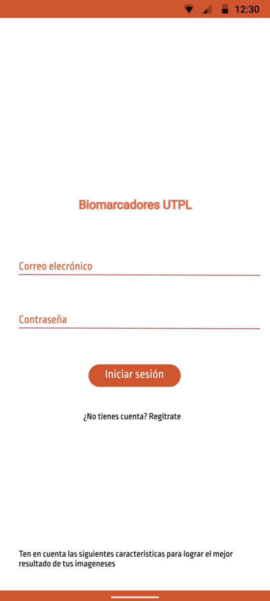
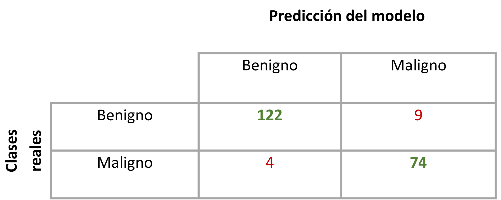
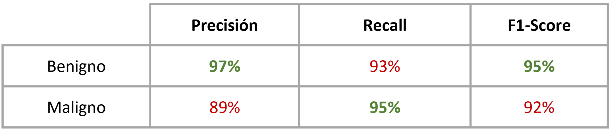
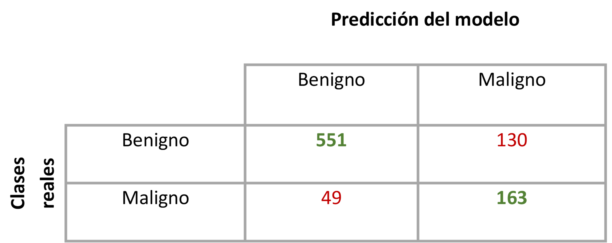
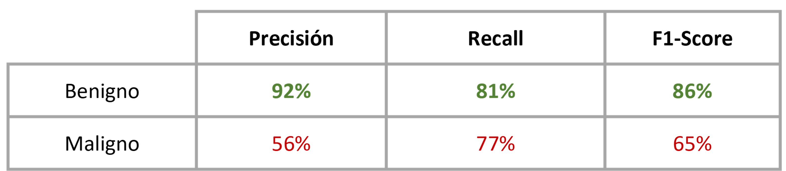

# App de biomarcadores - ES
En este repositorio se almacenan y detallan todos los avances de la aplicación realizada para poder clasificar imágenes de mama en benignas o malignas.
## Objetivo
Se plantea el desarrollo de un aplicativo móvil en el cual se carguen imágenes  completas de ultrasonido de mama o de mamografía y mediante el uso de un segmentador extraer la región de interés (RoI), con ello se aplicará un algoritmo clasificador para determinar si la imagen es benigna o maligna.
## Lenguajes empleados 
 - React Native 0.71 
 - Python 3.9 
## Herramientas/Frameworks utlizados
 - Pytorch
 - Figma
 - VS Code
 - Jupyter Notebooks
## Maqueta - Prototipo

  

## Modelos de clasificación
Los modelos de clasificación se basaron en el uso de Transfer Learning, específicamente con el uso de ResNet 18 y con sus capas preentrenadas. 
Los modelo que mayor exactitud presentaron para cada tipo de imágenes de (ultrasonido y mamografía)  fueron:
### Ultrasonido
Cantidad de imágenes para validación: benignas - 131, malignas - 78
 - Exactitud para imágenes benignas: 93.1% 
 - Exactitud para imágenes malignas: 94.9%
 - Estadísticas:

  
  

  

  

### Mamografía
Cantidad de imágenes para validación: benignas - 681, malignas - 212
 - Exactitud para imágenes benignas: 80.9% 
 - Exactitud para imágenes malignas: 76.9%
 - Estadísticas:

  
  

  

  

