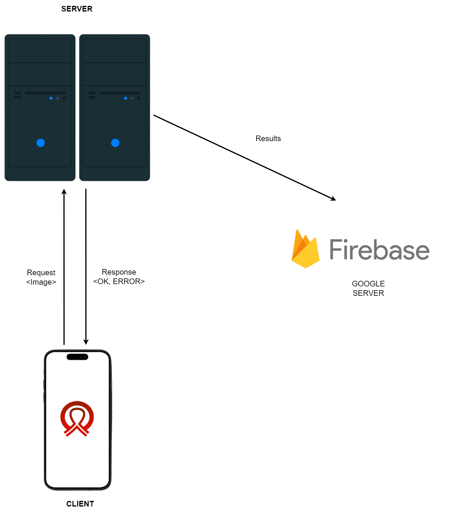
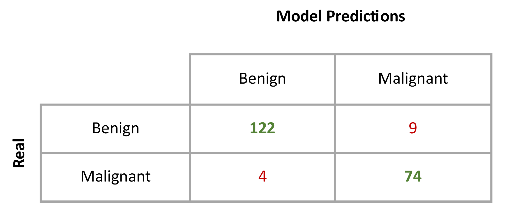
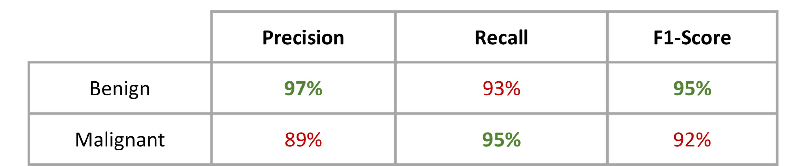
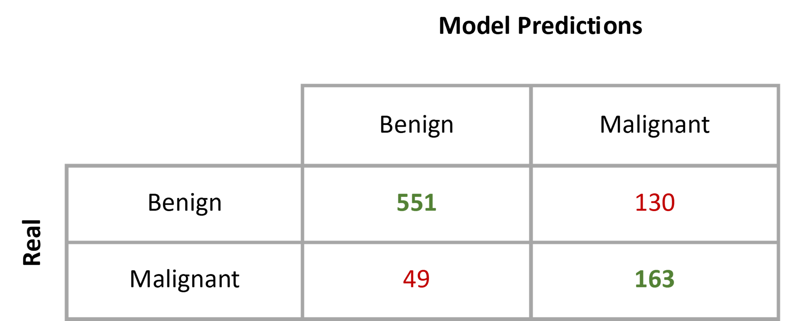
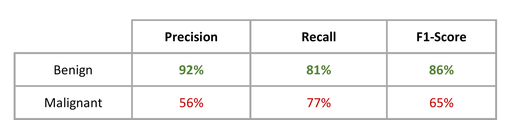

# BraNet - EN
In this repository, all the advances of the mobile application made to classify breast images (ultrasound and mammography) into benign or malignant are stored and detailed.
## Description
The development of a mobile application for Android and iOS devices is proposed, in which breast ultrasound or mammography images are loaded, then a segmenter is used to extract the regions of interest (ROI) (optional), finally a classifier algorithm is applied to these to determine if the image is benign or malignant.
### Languages used 
 - TypeScript
 - JavaScript
 - Python 3.11
### Tools/Frameworks used
 - Figma
 - VS Code
 - Jupyter Notebooks
 - Flask
 - PyTorch 2.0.1
 - React Native 0.71 
 ### Database and cloud plataforms
 - Google Firebase
 - Google Cloud
### Mockup - Prototype

  

### System architecture
Se planteó una arquitectura para la aplicación de tipo cliente-servidor, esta se basa en el envió y recepción de peticiones entre dos activos.
 

  

## Development

### Image classification models
The classification models were based on the use of Transfer Learning, specifically with the use of ResNet 18 with PyTorch and with its pre-trained layers. The models that presented the highest accuracy for each type of images (ultrasound and mammography) were:
#### Ultrasound
Number of images for validation: benign - 131, malignant - 78
 - Accuracy for benign images: 93.1%
 - Accuracy for malignant images: 94.9%
 - Statistics:

  
  

  

  

#### Mammography
Number of images for validation: benign - 681, malignant - 212
 - Accuracy for benign images: 80.9%
 - Accuracy for malignant images: 76.9%
 - Statistics:

  
  

  

  

### Image mask segmentation model
For the extraction of masks from the input images of the application, Segment Anything Model SAM was used, this free access model is made by Meta company, formerly known as Facebook, for more information visit the link to the original repository: https://github.com/facebookresearch/segment-anything/

### Use and restrictions
- To perform the analysis, you need to go to the “Analysis” tab, then select the type of image, either ultrasound or mammography, select the image and if desired, you can check the box “Extract masks and regions of interest”, finally click on the “Start evaluation” button (it is recommended to read all the recommendations in the Help module of the application before performing the analysis to obtain a more accurate result). You can watch the usage video tutorial in the repo_sources folder.
- The application only accepts three types of images JPG, JPEG, PNG.
- The size of the images must not exceed 10 MB.

***

# BraNet - ES
En este repositorio se almacenan y detallan todos los avances de la aplicación móvil realizada para clasificar imágenes de mama (ultrasonido y mamografía) en benignas o malignas.
## Descripción
Se plantea el desarrollo de un aplicativo móvil para dispositivos Android e iOS, en el cual se carguen imágenes de ultrasonido de mama o de mamografía, posteriormente mediante el uso de un segmentador se extrae las regiones de interés (ROI) (opcional), finalmente a estas se les aplicará un algoritmo clasificador para determinar si la imagen es benigna o maligna.
### Lenguajes empleados 
 - TypeScript
 - JavaScript
 - Python 3.11
### Herramientas/Frameworks utilizados
 - Figma
 - VS Code
 - Jupyter Notebooks
 - Flask
 - PyTorch 2.0.1
 - React Native 0.71 
 ### Base de datos y plataformas en la nube
 - Google Firebase
 - Google Cloud
### Maqueta - Prototipo

  

### Arquitectura del sistema
Se planteó una arquitectura para la aplicación de tipo cliente-servidor, esta se basa en el envió y recepción de peticiones entre dos activos.
 

  

## Desarrollo

### Modelos de clasificación de imágenes
Los modelos de clasificación se basaron en el uso de Transfer Learning, específicamente con el uso de ResNet 18 con PyTorch y con sus capas preentrenadas. 
Los modelos que mayor exactitud presentaron para cada tipo de imágenes de (ultrasonido y mamografía)  fueron:
#### Ultrasonido
Cantidad de imágenes para validación: benignas - 131, malignas - 78
 - Exactitud para imágenes benignas: 93.1% 
 - Exactitud para imágenes malignas: 94.9%
 - Estadísticas:

  
  

  

  

#### Mamografía
Cantidad de imágenes para validación: benignas - 681, malignas - 212
 - Exactitud para imágenes benignas: 80.9% 
 - Exactitud para imágenes malignas: 76.9%
 - Estadísticas:

  
  

  

  

### Modelo de segmentacion de máscaras de imágenes
Para la extracción de las máscaras de las imágenes de entrada de la aplicación se uso Segment Anything Model SAM, este modelo de libre acceso es elaborado por la compañía Meta, antes conocida como Facebook, para mas informacion visite el enlace del repositorio original: https://github.com/facebookresearch/segment-anything/

### Uso y restricciones
- Para realizar el análisis se debe ir a la pestaña de "Análisis" posteriormente se selecciona el tipo de imagen, ya sea ultrasonido o mamografía, se selecciona la imagen y si se desea se puede marcar la casilla "Extraer mascaras y regiones de interes", finalmente se da click en el botón "Iniciar evaluacióó" (se recomienda leer todas las recomendaciones en el módulo de "Ayuda" de la aplicación antes de realizar el análisis para obtener un resultado mas certero). Puedes observar el vídeotutorial de uso en la carpeta repo_sources.
- La aplicación admite únicamente tres tipos de imágenes JPG, JPEG, PNG.
- El tamaño de las imagenes no debe superar los 10 MB.
